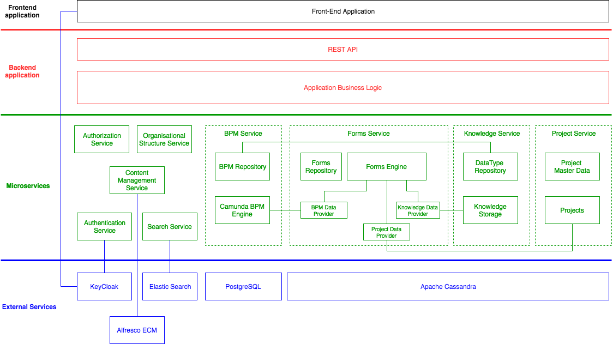

# Architecture overview

The Annette Axon Architecture schema is presented on the picture below:

The Annette Axon system is implemented as single page web application and contains the following components:
* Application (frontend & backend)
* Authentication service
* Authorization service
* Organizational Structure service
* BPM service
* Project service
* Knowledge service
* Forms service
* Content Management service
* Search service

## Application (frontend & backend)

Application has the following user roles:
* axon.user - ordinal user that has access to tasks, processes and projects according his or her rights
* axon.analytic - user that has rights to configure BPM System, organizational structures, forms, Knowledge System, Project Systems etc.
* axon.admin - user that has administrative rights such as manage user, user roles and permissions, manage execution of business processes  

All these users working in the same application window with menu depends of the user role. Application window has two components:
* toolbar - contains application logo & name, application menu, language selector, user menu
* main window - contains application content related to menu item selected by user

Application menu contains the following menu items:
* Tasks - shows BPM tasks assigned to user, history of user task. 
* Processes - shows business processes that user can start, list of running business processes started by user, list of completed business processes started by user.  
* Org. Structure - shows organisation structures that user assigned to.
* Projects - shows projects that user takes part in.
* Documents - shows user's documents
* Configuration - submenu contains configuration activities available to users with analytic role. Submenu contains the following items:
  * BPM - configuration of BPM
  * Org. Structure - configuration of organisational structure
  * Forms - configuration of Forms System
  * Knowledge - configuration of Knowledge System
  * Projects - configuration of Project System
* Administration - submenu contains administration activities available to users with admin role. Submenu contains the following items:
  * Authentication - forwards to Keycloak Administration Console that provide services related to users management and authentication configuration
  * Roles & Permissions - administration of permissions and assigning it to system roles
  * Export/Import - export/import system data

Language selector allows user to select system language. It represents as dropdown with the list of available languages. 
  
User menu represents as dropdown control with user's avatar, first and last name. Menu contains the following items:
* Settings - manage user settings such as theme, animations etc.
* Profile - manage user's profile. Menu item forwards to Keycloak user profile
* Logout - logout user
   
 
   

### Frontend

### Backend

## Authentication service

## Authorization service

Authorization service provides role based access control (RBAC). The following entities are used in the service:
* Role - entity with id, name and optional description that contains set of permissions that allows certain operations to the user assigned to this role 
* Permission - entity with id and optional arguments (up to 3) that allows to perform certain operation

Authorization service provides the following REST API for maintenance roles check find permissions:

* POST /api/authorization/role - createRole
* PUT /api/authorization/role - updateRole
* DELETE /api/authorization/role/:id - deleteRole
* GET /api/authorization/role/:id - findRoleById
* POST /api/authorization/findRoles - findRoles
* POST /api/authorization/checkAll - checkAllPermissions
* POST /api/authorization/checkAn - checkAnyPermissions
* POST /api/authorization/find - findPermissions

## Organizational Structure service

## BPM service

BPM Service contains two microservices:
* BPM Repository - stores process schemas and business processes
* BPM Engine - contains engine for business process execution

Process schema contains a schema definition in particular notation (BPMN/DMN/CMMN). These schemas deployed to the BPM Engine and can be executed.

Business process contains definition of the particular business process:
* Business process id
* Name
* Description
* Reference to schema id. Business process are started with reference of particular schema.
* Data structure with initial values. It is used to initialize process variables before start process. Data structures are defined in Knowledge Service (Data types repository) 

## Project service

## Knowledge service

## Forms service

## Content Management service

## Search service